# 🐍 Aprender Python

Una colección de proyectos prácticos para dominar Python paso a paso, **ordenados de menor a mayor dificultad**. Cada carpeta contiene una introducción al concepto, ejercicios para practicar y sus soluciones.

> El objetivo no es solo leer teoría, sino *escribir código*. Cada tema incluye ejercicios resueltos y sin resolver para que aprendas haciendo.

---

## 📚 Contenido

### 1 · Tuplas


Las tuplas son colecciones **ordenadas e inmutables**: una vez creadas, no cambian. Son perfectas para representar datos que no deberían modificarse (coordenadas, fechas, registros) y, al ser inmutables, son más rápidas y seguras que las listas. Tu primer paso para entender cómo Python organiza la información.

📂 [`01 - Tuplas`](./01%20-%20Tuplas)

---

### 2 · Sets

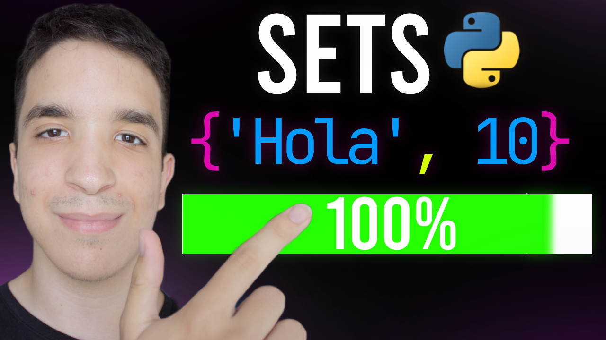

¿Necesitas eliminar duplicados al instante o comprobar si un elemento existe a toda velocidad? Los **sets** (conjuntos) son tu herramienta. Además, te dan operaciones matemáticas como unión, intersección y diferencia con una sintaxis elegante. Descubre por qué son uno de los secretos mejor guardados para escribir código limpio.

📂 [`02 - Sets`](./02%20-%20Sets)

---

### 3 · List Comprehensions


Convierte cinco líneas de bucles en una sola, legible y eficiente. Las **list comprehensions** son una de las características más queridas de Python: te permiten crear y transformar listas de forma expresiva. Aprenderás a pensar "al estilo Python" y tu código nunca volverá a ser el mismo.

📂 [`03 - List Comprehensions`](./03%20-%20List%20Comprehensions)

---

### 4 · Lambda

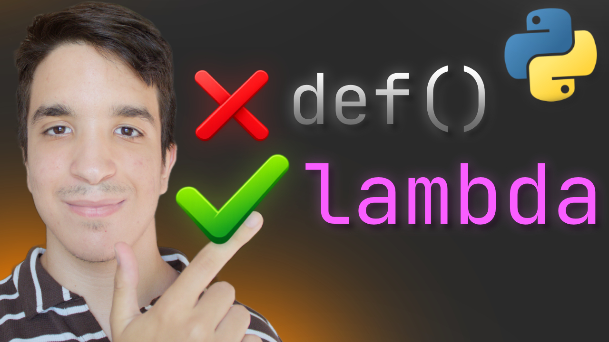

Funciones tan pequeñas que caben en una sola línea y no necesitan nombre. Las funciones **lambda** brillan cuando las combinas con `map`, `filter` y `sorted`, permitiéndote escribir lógica potente de forma concisa. Una puerta de entrada al mundo de la programación funcional.

📂 [`04 - Lambda`](./04%20-%20Lambda)

---

### 5 · Args y Kwargs

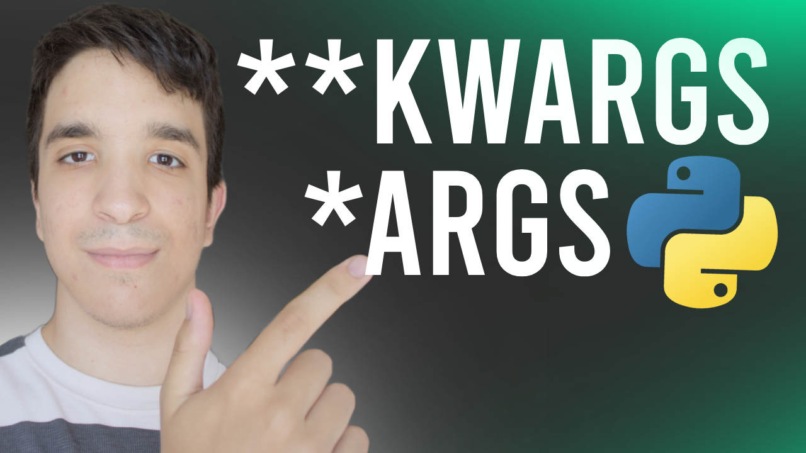

¿Y si una función pudiera aceptar cualquier número de argumentos? Con `*args` y `**kwargs` creas funciones **flexibles y reutilizables** que se adaptan a lo que necesites. Es la base para entender cómo funcionan muchas librerías profesionales por dentro.

📂 [`05 - Args y Kwargs`](./05%20-%20Args%20y%20Kwargs)

---

### 6 · Name Main

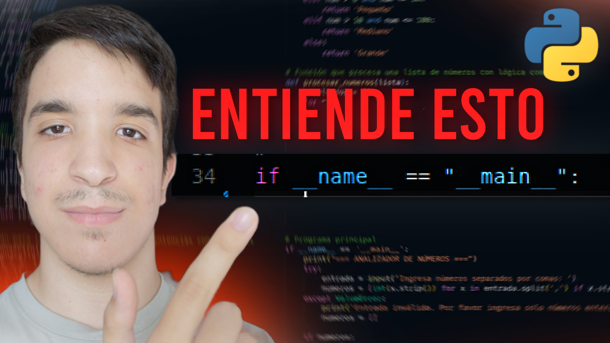

`if __name__ == "__main__":` aparece en casi todos los scripts profesionales… ¿pero sabes *por qué*? Aquí entenderás cómo Python distingue entre ejecutar un archivo directamente o importarlo como módulo, una pieza clave para organizar proyectos reales.

📂 [`06 - Name Main`](./06%20-%20Name%20Main)

---

### 7 · Paquetes vs Módulos


¿Cómo se organizan los proyectos grandes? Un **módulo** es un archivo `.py` y un **paquete** es una carpeta con `__init__.py` que agrupa varios módulos. Aprenderás a importar con notación de puntos, a diseñar una API pública limpia con `__all__`, los imports relativos y trucos profesionales como los *namespace packages*. La clave para pasar de scripts sueltos a proyectos de verdad.

📂 [`07 - Paquetes vs Modulos`](./07%20-%20Paquetes%20vs%20Modulos)

---

### 8 · Context Managers

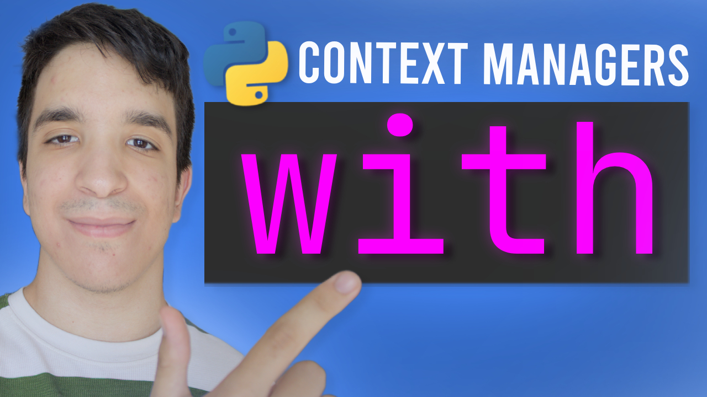

El famoso `with open(...)` no es magia: es un **context manager**. Aprenderás a gestionar recursos (archivos, conexiones, bloqueos) de forma segura, garantizando que siempre se liberen aunque algo falle. Incluso crearás los tuyos propios. Código robusto de nivel profesional.

📂 [`08 - Context Managers`](./08%20-%20Context%20Managers)

---

### 9 · Generadores

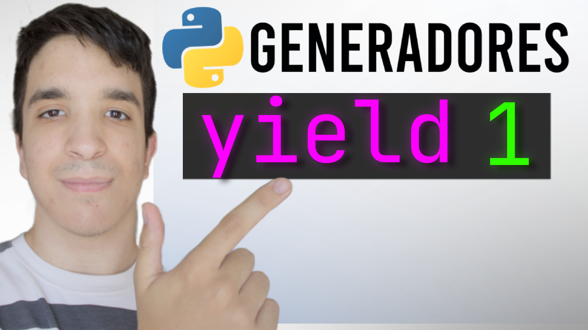

¿Trabajar con millones de datos sin agotar la memoria? Los **generadores** producen valores *bajo demanda*, uno a uno, en lugar de cargarlo todo a la vez. Con `yield` desbloquearás un nivel superior de eficiencia y elegancia.

📂 [`09 - Generadores`](./09%20-%20Generadores)

---

### 10 · Dunder Methods

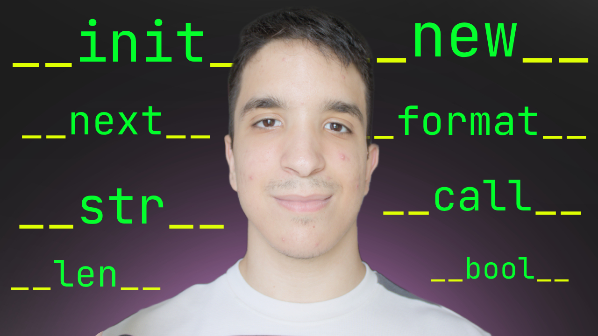

Los **métodos mágicos** (o *dunder methods*, por el doble guion bajo en `__metodo__`) son los que Python llama por detrás cuando usas `+`, `==`, `len()`, `print()` o un `for`. Definiéndolos, tus propios objetos se comportan como los tipos nativos: podrás sumarlos, compararlos, iterarlos o imprimirlos a tu gusto. El broche de oro: el nivel más alto de personalización en la programación orientada a objetos.

📂 [`10 - Dunder Methods`](./10%20-%20Dunder%20Methods)

---

### 11 · Closures

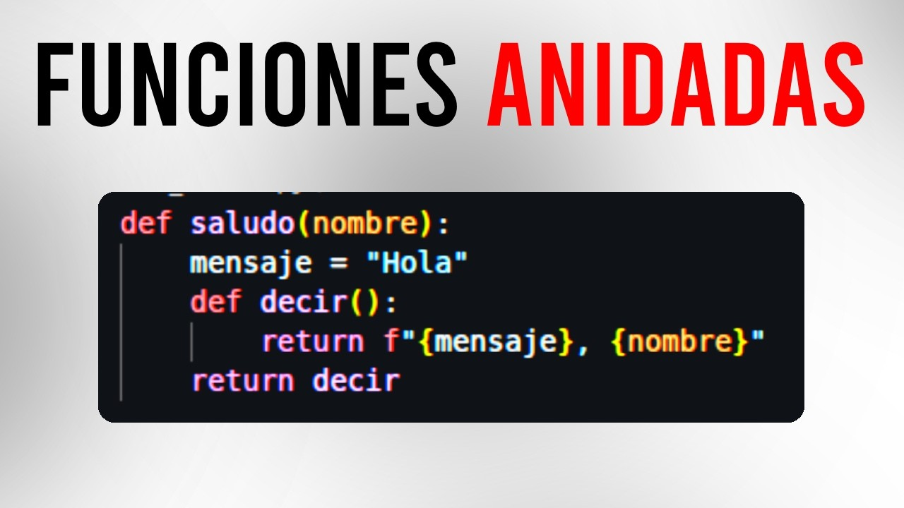

Una función que se lleva una **"mochila"** con las variables del lugar donde nació y las recuerda para siempre, aunque ese lugar ya no exista. Los **closures** te permiten fabricar funciones a medida, mantener estado sin usar clases y entender de una vez la regla LEGB. Son, además, la base directa sobre la que se construyen los decoradores.

📂 [`11 - Closures`](./11%20-%20Closures)

---

### 12 · Async / Await

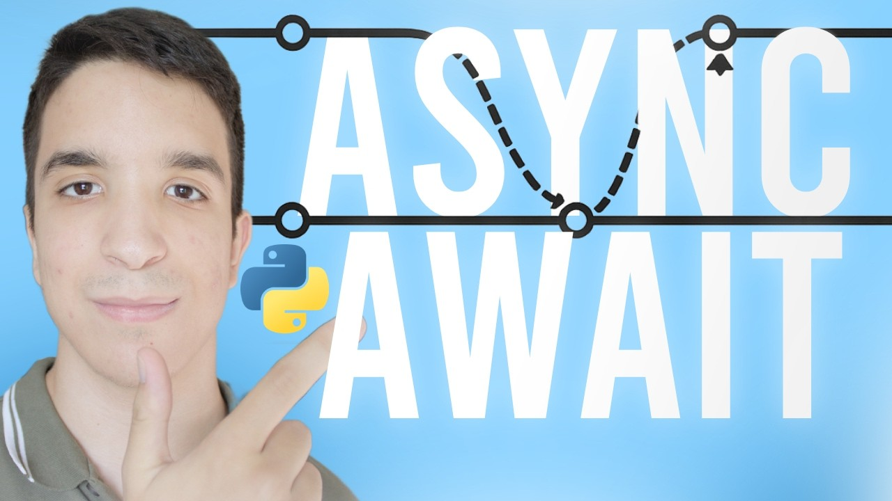

¿Y si, mientras tu programa **espera** una descarga o una consulta a la base de datos, pudiera ir avanzando otras diez tareas? Con `async`/`await` escribes código **concurrente** con un solo hilo: descargas que pasan de 5 segundos a 1, colas de trabajo con varios *workers* y control fino con `TaskGroup`, `Semaphore` y `timeout`. El salto que separa a un script que espera de uno que rinde.

📂 [`12 - Async Await`](./12%20-%20Async%20Await)

---

### 13 · Dataclasses

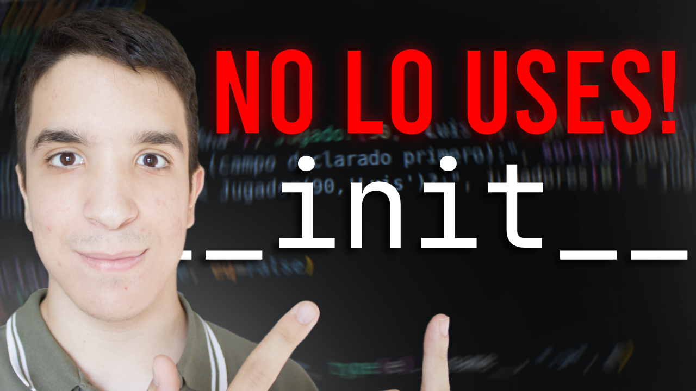

Escribir `__init__`, `__repr__` y `__eq__` a mano en cada clase que solo guarda datos es puro boilerplate mecánico. El decorador `@dataclass` lo genera por ti a partir de las anotaciones de tipo: valores por defecto seguros con `field()`, atributos de clase con `ClassVar`, validaciones en `__post_init__`, instancias inmutables y *hashables* con `frozen=True`, comparación y orden con `order=True`, copias con `replace()` y conversión a dict con `asdict()`. La forma moderna y segura de modelar datos en Python.

📂 [`13 - Dataclasses`](./13%20-%20Dataclasses)

---

### 14 · Slots


Cada instancia normal carga con su propio `__dict__`, aunque todos los objetos de la clase tengan siempre los mismos campos: memoria desperdiciada a gran escala. `__slots__` le dice a Python qué atributos existen de antemano y elimina ese diccionario por instancia, ahorrando memoria y detectando al vuelo los errores tipográficos (`AttributeError` en vez de un atributo fantasma). Aprenderás la herencia correcta e incorrecta con slots, el modo híbrido con `__dict__` y a medir el ahorro real con `sys.getsizeof` y `timeit`.

📂 [`14 - Slots`](./14%20-%20Slots)

---

### 15 · Descriptores

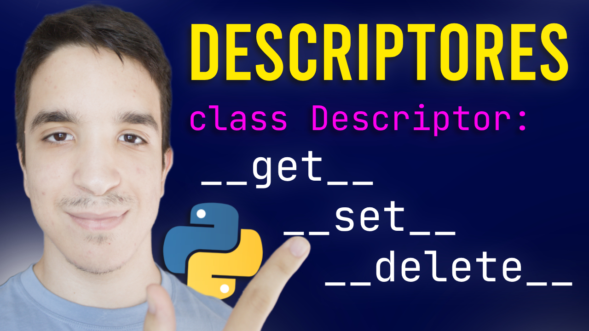

`@property`, los atributos de las dataclasses y `__slots__` tienen algo en común por debajo: todos son **descriptores**. Un descriptor es cualquier objeto que define `__get__`, `__set__` o `__delete__` y que, colocado como atributo de clase, intercepta la lectura, escritura o borrado de ese atributo. Aprenderás la diferencia entre *data* y *non-data descriptors*, el papel de `__set_name__` y, sobre todo, por qué un descriptor reutilizable elimina la duplicación de validaciones que `@property` te obliga a copiar y pegar en cada atributo.

📂 [`15 - Descriptores`](./15%20-%20Descriptores)

---

### 16 · ABC (Abstract Base Classes)

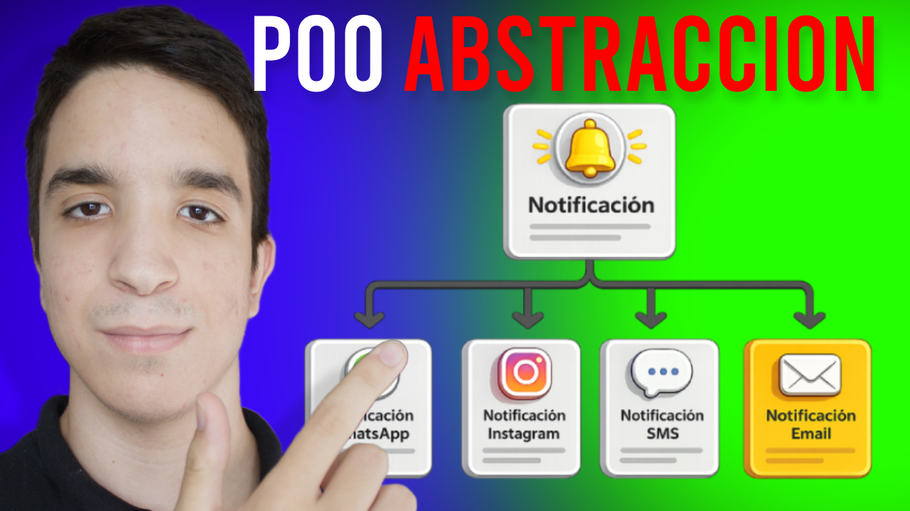

Un canal de notificaciones que "olvida" implementar `enviar()` y falla en silencio en producción; un conector de almacenamiento a medias que es un desastre el día que hay que restaurar un backup. Las **ABC** (clases base abstractas) obligan a cumplir un contrato en tiempo de creación de la instancia, no cuando ya es tarde. Aprenderás `@abstractmethod`, propiedades abstractas, `isinstance`/`issubclass` para validar contratos, `register()` para adoptar clases de terceros, las ABCs de `collections.abc` y el patrón Template Method. La diferencia entre un bug que revienta en producción y uno que Python te impide escribir.

📂 [`16 - ABC (Abstract Base Classes)`](./16%20-%20ABC%20%28Abstract%20Base%20Classes%29)

---

### 17 · Excepciones Personalizadas

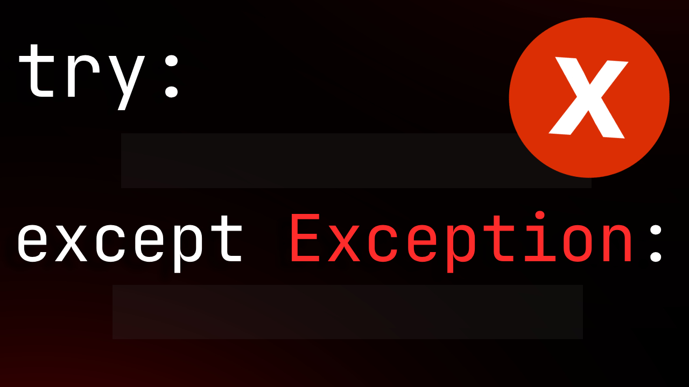

Un `except Exception` sin relanzar que hace que un pedido fallido se procese "como si nada"; un error de bajo nivel de la base de datos que se filtra tal cual hasta el usuario. Las **excepciones personalizadas** convierten fallos genéricos en errores con nombre, jerarquía y datos propios. Aprenderás a diseñar tu propia jerarquía de errores, `raise ... from ...` para encadenar sin perder contexto, el flujo completo `try/except/else/finally`, cuándo hacer *re-raise* y cuándo no capturar, `add_note()` para enriquecer errores ya lanzados, y `ExceptionGroup`/`except*` para reportar varios fallos a la vez. La base de un manejo de errores que no oculta bugs.

📂 [`17 - Excepciones Personalizadas`](./17%20-%20Excepciones%20Personalizadas)

---

### 18 · JSON


Una config guardada como texto plano casero que se rompe en cuanto otro servicio necesita leerla; una respuesta de una API externa mal formada que tumba la app si nadie la controla. El módulo **json** es el formato estándar que cualquier lenguaje sabe leer y escribir. Aprenderás `dumps`/`loads` frente a `dump`/`load`, la tabla de conversión de tipos Python ↔ JSON, `JSONDecodeError` para blindarte ante datos externos corruptos, `default=` para serializar `datetime`/`Decimal`/objetos propios, `object_hook=` para reconstruirlos al deserializar, y las opciones de formato (`indent`, `ensure_ascii`, `separators`) según guardes en disco, envíes por red o depures en consola. La diferencia entre una config que solo tu script entiende y una que habla el mismo idioma que el resto del sistema.

📂 [`18 - JSON`](./18%20-%20JSON)

---

## 🚀 Cómo empezar

```bash
# Clona el repositorio
git clone <url-del-repositorio>

# Entra en el tema que quieras aprender
cd "01 - Tuplas"

# Ejecuta la introducción
python introduccion.py
```

Cada carpeta sigue la misma estructura: un archivo de **introducción**, **ejercicios** para resolver y sus **soluciones**. ¡Empieza por el número 1 y avanza a tu ritmo!
